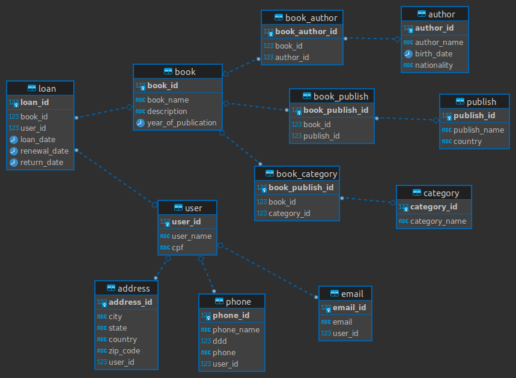

# Estrutura de Dados

## Origem

- 1950 - Era da computação
  - computar dados
  - foco no hardware
  - usado para controle de contas como água, luz

 

- 1970 - Era da Informática
  - informação
  - foco no software
  - usado para processar toda informação recebida

 

- 1990 - Era do Conhecimento
  - chegada da Internet
  - análise dos dados para tomadas de decisão

 

---

 

- _Dados:_ estado bruto, capturados de diversas formas.
- _Informação:_ dados trabalhados, que deté, algum tipo de valor.
- _Conhecimento:_ informação colocada em prática, ação prática baseada naquela informação, poder de decisão, análise de padrões de comportamento.

---

 

## Banco de Dados

- Local de armazenamento de informações/dados em grande volume.
- Repositório de informações.
- Tecnologias de gerenciamento de dados.

 

**Dados relacionais**: Quando precisa de uma estrutura de dados.

**Dados não relacionais**: Quando não possuem uma estrutura de dados definida, que podem ser atribuídas somentes chaves e valores.

 

## Gerenciamento de Dados

Benefícios de ferramenta e gerenciamento de dados:

- Proteger os dados restringindo acessos.
- Registro de ações dentro do banco.
- Regras de armazenamento para evitar insert de informações erradas.
- Escabilidade.

 

## Elementos de Visualização

- Banco de dados contém arquivos assim como nos computadores.
- SGBD - Sistema Gerenciados de Banco de Dados: é uma interface amigável para mostrar os arquivos e dados dentro do banco de dados.
   
  _Ex.:_ SQL server (linhas e tabelas).
- SQL - Structured Query Laguage: linguagem padrão de comunicação entre humano com o banco de dados. Ex
   
  _Ex.:_ SELECT \* FROMTB_CLIENTS

 

\*Obs.: Saber manipular os dados e cruzá-los podem gerar vantagem competitiva.

 

## Entidade

Entidade de dados é uma representação do mundo real, ou seja, é atabela dentro do banco de dados.
 
Ex.: cliente -> venda -> prodruto

Importante: As entidades dever ser unicas dentro de ummesmo schemade dados.

 

## Atributo

Atributo é aquilo que caracteriza uma entidade, as informaões que serão armazenadas, ou seja, são as colunas de uma tabela.

 

## Tuplas

Tuplas são os valores dos atributos, ou seja, são as linhas.

 

## Relacionamento

O relacionamento representa a associação que podemos ter entre duas ou mais entidades.

 

## Cardinalidade

Cardinalidade é um conceito que determina quantos itens podem se relacionar entre as entidades.

 

## Tipos de Relacionamentos

 

### 1...N - Um para muitos

Exemplo: Um cliente pode fazer N pedidos.

### 1...1 - Um para um

Exemplo: Um pedido específico só pode estar relacionado a um cliente.

### N...N - Muitos para muitos

Exemplo: Um pedido têm vários produtos e um produto têm vários pedidos.
Quando isso acontece, geralmente quebra em umaterceira entidade, com a **_normalização_** de dados.

 

## Identificadores

- (PK) Primary Key - é a principal chave de uma entidade, identificando de forma única e exclusiva um resgistro.
    Exemplo: "ID" não pode ter repeticação nem ser nulo.
- (FK) Foreign Key - é a chave estrangeira que determina relacionamento entre duas tabelas.
    Exemplo: o "customer_id" na tabela de "pedidos".

 

## Análise de Requisitos

**Requisito** é tudo aquilo que precisa ser atendido, que sua demanda precisa fazer, que seu job precisa resolver.

- Possibilita que o problema seja resolvido.
- Supre necessidades reais.

Para entender esses requisitos é necessário fazer as seguintes perguntas:

- O quê?
- Por quê?
- Como?
- Para quê?
- Quanto tempo?

Entender a demanda do cliente e analisar qual solução, o ajudará no que precisa para realizar o projeto.
Você deve questionar tudo para evitar retrabalho e perca de tempo, portanto, dê um passo para trás, entenda o macro e depois proponha um Brandstorm para pegar idéias com sua equipe.

 

## Tipos de Modelagem

_Modelagem Conceitual_: criar diagrama, alto nível que referência o negócio. Objetivo é capturar os requisitos e modelar com uma visão de negócio, regras de negócio, acontece junto ao cliente.

Definiçao de entidade, relacionamento, cardinalidade e atributos.

_Modelagem Lógica_: faz link entre a modelagem conceitual e a física.

Definição de entidades, atributos, cardinalidade, definição de chaves.

_Modelagem Física_: transformar o diagrama de modelagem lógica em física. Usar SGBD, descobrir as limitações que existe dentro dele.

Definição de entidades, atributos, cardinalidade, definição de chaves, tipo de dados e restrições para cada um dos atributos na parte tecnica com o diagrama.

Deixar o diagrama pronto para ser lido pelo SGBD.

 

## Normalização de Dados

É um conjunto deregras que servem para protegemos os dados, deixando o banco mais flexível, eliminando redundância de informação e minimizando os custos de mudança/manutenção.

_Exemplo_: no momento de alterar umainformação faremos isso apenas em uma tabela e também não ocupados espaço sem necessidade. Ideal para casdastramento de vários telefones e endereços de uma mesma pessoa, ao que chamamos de **atributo multivalorado**.

O ideal é que um banco de dados tenha três niveis de normalização no mínimo.

 

### 1ª forma normal

Serve para eliminar atributos multivalorados(\*) ou compostos, como telefones, email e endereços. Quando você quebra esses dados uma nova tabela é criada, por exemplo email, telefone...

Podemos também quebrarmos o endereço completo por atributos separados como Rua | Bairro | Cidade nao havendo a necessidade de uma nova tabela, só gera novos atributos, mas podemos colocar em uma nova se quisermos.

Obs.: atingimos a 1ª forma normal quando em uma tabela todos atributos são atômincos, ou seja, que não consegue dividir, único valor.

 

### 2ª forma formal

Os atributos de cada tabela precisam ser independentes entre si. Remoção de chaves primárias compostas. Uma única chave precisa determinar o todo.

 

| ID_FUNCIONARIO | NOME | ID_TAREFA | DESCRIÇÃO_TAREFA |
| -------------- | ---- | --------- | ---------------- |

Id_Funcionario e Id_tarefa com a Descrição_Tarefa = chave primária composta

São atributos independentes.
Para resolver podemos criar uma nova entidade somente para descrição das tarefas.

Por fim, as chaves compostas se tornarãoem chave primária + chave estrangeira.

 

### 3ª forma formal

Remover as dependencias transitivas, não deve existir um atributo não chave sendo determinado funcionalmente por um outro atributo.

Exemplo: somente com código do vendedor conseguimos saber o nome do vendedor.

 

| NF  | SERIE | COD_VENDEDOR | NOME_VENDEDOR |
| --- | ----- | ------------ | ------------- |

Cod. Vendedor + Nome_Vendedor = dependência transitiva

Para resolver, criar uma tabela para o vendidos entrando como chave estrangeira.

 

## Banco de Dados Não Relacional

É eficiente para expandir sua capacidade para acomodar um grande volume de dados, sendo fator importante para empresas que necessitam lidar com grandes quantidades de dados em constante crescimento.

São mais flexíveis em relação a mudanças do que em tabelas com sistema mais rigidos, facil de lidar com dados complexos não estruturados, como documento, viagens e vídeos.

Desempenho rápido principalmente para consultar em tempo real.

Baixo custo em termos de instraestrutura e manutenção.

 

_By Xênia Barreto_
